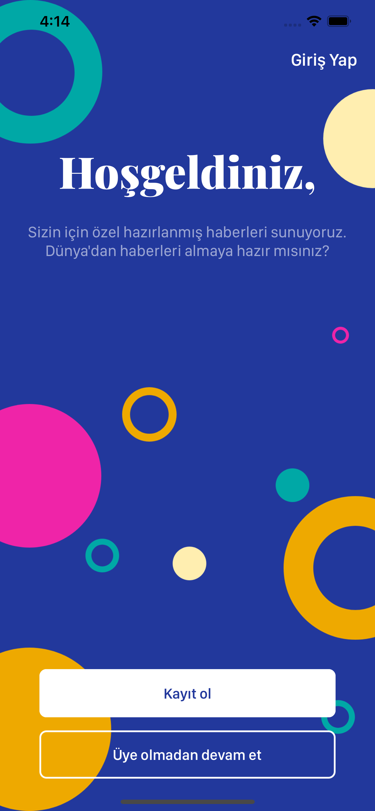
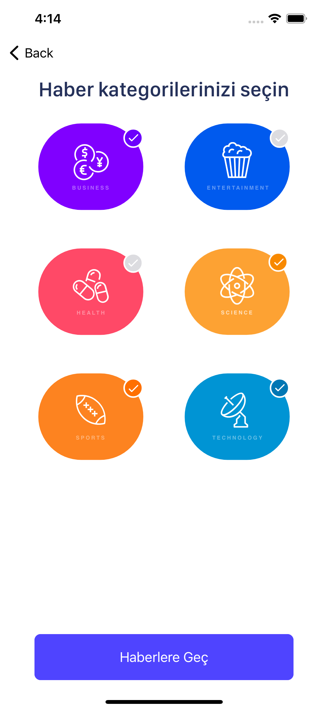
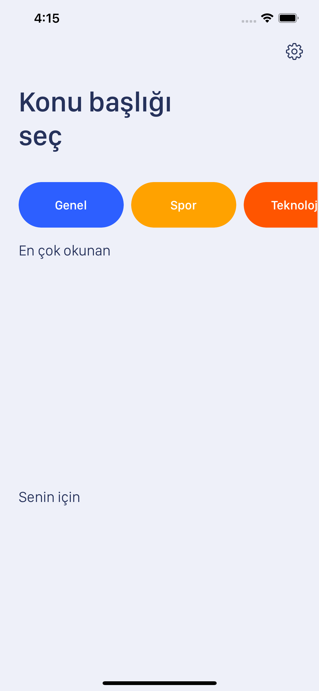
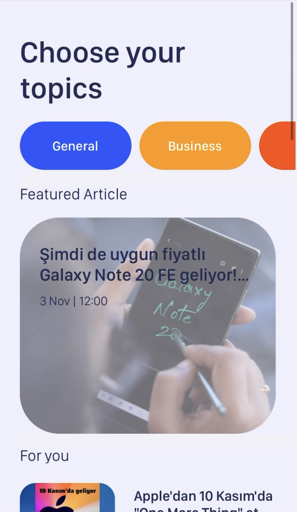

<!-- PROJECT LOGO -->
 

   

  <h3 align="center">News App Swift</h3>

  

    With this project, I focused on the Request library, JSON and RESTFul App.
     
    <a href="https://github.com/bilaldurnagol/PhotoFilterRxSwift"><strong>Explore the docs »</strong></a>
     
     
    <a href="https://github.com/bilaldurnagol/PhotoFilterRxSwift">View Demo</a>
    ·
    <a href="https://github.com/bilaldurnagol/PhotoFilterRxSwift/issues">Report Bug</a>
    ·
    <a href="https://github.com/bilaldurnagol/PhotoFilterRxSwift/issues">Request Feature</a>
  

<!-- TABLE OF CONTENTS -->

  
Table of Contents

  <ol>
    <li>
      <a href="#about-the-project">About The Project</a>
      <ul>
        <li><a href="#built-with">Built With</a></li>
      </ul>
    </li>
    <li>
      <a href="#getting-started">Getting Started</a>
      <ul>
        <li><a href="#Requirements">Requirements</a></li>
        <li><a href="#installation">Installation</a></li>
      </ul>
    </li>
    <li><a href="#usage">Usage</a></li>
    <li><a href="#roadmap">Roadmap</a></li>
    <li><a href="#contributing">Contributing</a></li>
    <li><a href="#license">License</a></li>
    <li><a href="#contact">Contact</a></li>
  </ol>

<!-- ABOUT THE PROJECT -->
## About The Project

 It is an application where you can read current news according to location and categories.
 It has been disconnected from the server so that it does not send many requests.

   
   
     
   

Here's why:
* To learn Request and JSON
* To learn how to restful application

### Built With

The frameworks I used in this project are listed below.
* Nil

<!-- GETTING STARTED -->
## Getting Started

 This is an example of how you may give instructions on setting up your project locally. To get a local copy up and running follow these simple example steps.

### Requirements

* Xcode 12.x
* Swift 5.x

### Installation
There is no external library.

<!-- USAGE EXAMPLES -->
## Usage

<table>
  <tr>
    <th width="30%">Here's an example</th>
  </tr>
  <tr>
    <td>Get all articles...</td>
  </tr>
  <tr>
    <td>
<pre>
    public func getArticles(url: String, completion: @escaping (Result<[Article]?, Error>) -> ()) {
        guard let url = URL(string: url) else {return}
        URLSession.shared.dataTask(with: url, completionHandler: {data, response, error in
            guard let data = data, error == nil else {
                completion(.failure(DatabaseManagerError.failedToFetchArticles))
                return
            }
            let articles = try? JSONDecoder().decode(ArticleList.self, from: data)
            completion(.success(articles?.articles))
        }).resume()
    }
  </tr>
</table>

<!-- LICENSE -->
## License

Distributed under the MIT License. See `LICENSE` for more information.

<!-- CONTACT -->
## Contact
   

   

   

   
 
 
  

Project Link: [https://github.com/bilaldurnagol/News](https://github.com/bilaldurnagol/News)
